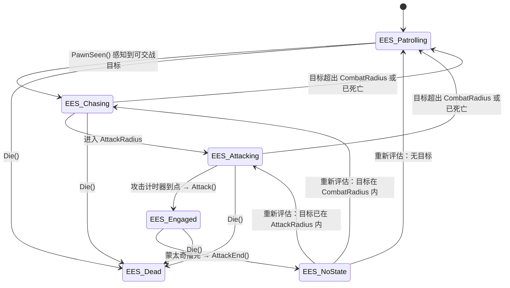

# SlashGameProject

一个基于 **Unreal Engine 5.0** 的第三人称 ARPG 动作游戏原型（C++ + 蓝图混合开发）。

包含近战连击、装备/收刀、方向性受击反馈、四方向死亡动画、Chaos 破碎、战利品与灵魂拾取、
敌人 AI 巡逻-追击-攻击状态机以及 HUD 血条等完整战斗循环。

> ⚠️ **本仓库只包含项目自有的核心内容**。第三方素材库（AncientContent、Megascans 贴图、
> 植被包等）体积达 30 GB 且受各自许可协议约束，未纳入版本管理。
> **完整还原所需素材清单见 [ASSETS_REQUIRED.md](ASSETS_REQUIRED.md)。**

---

## 操作方式

| 按键 | 功能 |
|---|---|
| `W` `A` `S` `D` | 移动 |
| 鼠标 | 视角旋转 |
| `Space` | 跳跃 |
| `E` | 装备 / 收起武器 |
| `鼠标左键` | 攻击（武器已装备时） |

按键绑定见 `Config/DefaultInput.ini`。

---

## 核心系统

### 角色与战斗

| 类 | 说明 |
|---|---|
| `ABaseCharacter` | 战斗基类。实现 `IHitInterface`，负责生命值、伤害结算、蒙太奇驱动的攻击/死亡/受击动画、方向性受击反馈（`DirectionalHitReact`）与 MotionWarping 位移对齐（`GetTranslationWarpTarget` / `GetRotationWarpTarget`）。 |
| `ASlashCharacter` | 玩家角色。弹簧臂 + 摄像机、Groom 头发/眉毛，通过 `ECharacterState` / `EActionState` 双状态机控制装备与攻击；实现 `IPickupInterface` 处理拾取并把金币/灵魂同步到 HUD。 |
| `UAttributeComponent` | 属性组件，管理 `Health` / `MaxHealth` 与金币 `Gold` / 灵魂 `Souls`，提供 `ReceiveDamage`、`GetHealthPercent`、`IsAlive`、`AddGold` / `AddSouls` 及对应 Getter。 |
| `IHitInterface` | 命中接口（`BlueprintNativeEvent`），武器命中时回调 `GetHit`，由 C++ 与蓝图共同实现。 |

### 拾取物、武器与命中检测

- `IPickupInterface` — 拾取接口，定义 `SetOverlappingItem(AItems*)`、`AddSouls(ASouls*)` 与
  `AddGold(ATreasure*)`。拾取物只与接口交互，不再依赖具体的角色类。
- `AItems` — 拾取物基类：悬浮正弦动画、`SphereComponent` 重叠检测、Niagara 特效（`ItemEffect`）；
  重叠时通过 `IPickupInterface::SetOverlappingItem` 把自身交给拾取者。
  拾取音效与特效也下沉在这里：`SpawnPickupSound()` / `SpawnPickupSystem()`，
  分别由 `PickupSound`（`USoundBase`）与 `PickupEffect`（`UNiagaraSystem`）驱动，供各拾取物复用。
- `AWeapon` — 武器：`BoxTrace` 盒型扫掠 + `Tick` 逐帧检测双保险（修复攻击时偶发打不碎物体的问题），
  命中后按 `Damage` 结算并调用 `ExecuteGetHit` 触发 `CreateFields`（Chaos 力场）。
- `ATreasure` — 战利品：重叠时通过 `IPickupInterface::AddGold` 交付金币，播放拾取音效后销毁。
- `ASouls` — 灵魂拾取物：重叠时通过 `IPickupInterface::AddSouls` 交付灵魂，播放拾取音效与
  Niagara 特效后销毁；敌人死亡时由 `AEnemy::SpawnSoul()` 按 `SoulClass` 在尸体处掉落。

### 敌人 AI

`AEnemy` 继承 `ABaseCharacter`，使用 `UPawnSensingComponent` 感知玩家。初始状态为 `EES_Patrolling`，
每帧由 `Tick` 分发：`EES_NoState` / `EES_Patrolling` 走 `CheckPatrolTarget()`，
`EES_Chasing` 及以上走 `CheckCombatTarget()`。



- **`EES_Engaged` 不会被中途打断**：此时 `CheckCombatTarget` 里的脱战与追击分支都被 `!IsEngaged()`
  挡住，必须等攻击蒙太奇播完、`AttackEnd()` 把状态切回 `EES_NoState` 后再重新评估。
- `EES_NoState` 只是过渡态：`AttackEnd()` 会立刻调用 `CheckCombatTarget()` 重新决定去向。
- `EES_Dead` 是终态，`Tick` 一开始就 `return`，不再评估任何 AI。
- 巡逻半径内的随机点导航（`PatrolTimer` 定时切换），进入 `CombatRadius` 追击、`AttackRadius` 攻击。
- 头顶血条通过 `UHealthBarComponent` 按需显示/隐藏。
- 受击硬直（`bHitReacting`）期间挂起 Tick 与 AI 逻辑，待受击蒙太奇播完再恢复；
  被连击打断时由 `OnHitReactMontageEnded` 等待最新一次动画结束。
- 死亡时按受击方向选择 `EDeathPose`（前/后/左/右），`SpawnSoul()` 掉落灵魂，
  `DeathLifeSpan` 秒后销毁。
- **玩家死亡后自动脱战**：`CheckCombatTarget` 检测到目标带 `Dead` 标签时，立即清空攻击计时器、
  `LostInterest()` 清空目标并隐藏血条、`StartPatrolling()` 回到巡逻（覆盖追击与攻击两条路径）；
  `PawnSeen` 索敌时同样排除已死亡目标，避免敌人回巡逻后被尸体反复拉回战斗。

### 死亡系统

`ABaseCharacter::Die(const FVector& ImpactPoint, AActor* Hitter)` 用点积/叉积算出受击方向，
**方向取攻击者 `Hitter` 的位置**（而非受击点，避免碰撞点偏移导致方向误判），
据此选出死亡蒙太奇 section 并写入 `DeathPose` 供动画蓝图读取；同时给角色打上 `Dead` 标签。

- `ASlashCharacter::Die` — 置 `EActionState::EAS_Dead` 锁住移动 / 跳跃 / 攻击 / 装备输入，
  关闭网格碰撞并立刻清除残余速度；重复命中不会重播死亡动画。
- `AEnemy::Die` — 关血条、禁胶囊、`SetLifeSpan(DeathLifeSpan)` 后销毁。
- 死亡蒙太奇 `AM_EchoDeath` 的四个 section 名为 **`DeathFromFront` / `DeathFromBehind` /
  `DeathFromLeft` / `DeathFromRight`**（注意带 `Death` 前缀，与受击蒙太奇不同）。
  `PlayDeathMontage` 会先用 `UAnimMontage::IsValidSectionName` 校验并输出告警——
  section 名不匹配时 `Montage_JumpToSection` 会**静默失败**，导致每次都从第一段开始播。
- 死亡姿势序列位于 `Content/Blueprints/Characters/Animations/Death/`。

### 破碎与破坏

`ABreakableActor` 使用 `UGeometryCollectionComponent`（Chaos Destruction）实现陶罐/瓮/花瓶的碎裂，
命中后按 `TreasureClasses` 随机生成战利品并禁用胶囊碰撞。
静态几何集合资源位于 `Content/Destructibles/`。

### 动画与 HUD

- `USlashAnimInstance` — 向动画蓝图暴露 `GroundSpeed`、`IsFalling`、`CharacterState`、
  `ActionState`、`DeathPose`。
- `ASlashHUD`（继承 `AHUD`）— 在 `BeginPlay` 中按 `SlashOverlayClass` 创建 `USlashOverlay`
  并 `AddToViewport`，对应蓝图 `Content/Blueprints/HUD/BP_SlashHUD.uasset`。
- `USlashOverlay` — 玩家 HUD：生命/耐力进度条、金币与灵魂计数（`BindWidget` 绑定 `WBP_SlashOverlay`）。
- `UHealthBar` / `UHealthBarComponent` — 敌人头顶血条（绑定 `WBP_HealthBar`）。

---

## 目录结构

```
slash2.uproject                 工程文件（UE 5.0）
Config/                         引擎 / 输入 / 游戏模式配置
Source/slash2/
  Public/ · Private/
    Characters/                 角色、动画实例、死亡姿势与状态枚举
    Components/                 属性组件
    Interfaces/                 命中接口与拾取接口
    Items/                      拾取物、武器、战利品、灵魂
    Enemy/                      敌人 AI
    Breakable/                  Chaos 破碎物
    HUD/                        ASlashHUD、血条与 HUD 控件
    Pawns/                      Bird Pawn
Content/
  Blueprints/                   全部蓝图（角色与动画 / 敌人 / 拾取物 / HUD / GameMode）
    Characters/Animations/      攻击 / 受击 / 装备 / 死亡蒙太奇，Death/ 存放死亡姿势序列
    Items/Pickups/              Treasures/ 战利品蓝图、Souls/ 灵魂蓝图
  Map/                          关卡：NewMap（World Partition）、TestMap
  __ExternalActors__/           关卡外部 Actor（World Partition 数据，NewMap 主体内容）
  Assets/                       音效、UI 贴图、中文字体
  Effects/                      粒子、Niagara 特效与相关材质（NS_Soul / M_SoulGlow）
  Destructibles/                Chaos 几何集合（破碎物）
  Landscape/                    地形材质与图层信息
Assests/Mixamo/                 Mixamo 角色与动画的 FBX 源文件（含贴图与音效源文件）
```

> `Assests/` 为工程内既有的原目录名（拼写如此），保留原状以免影响本地流水线。

---

## 快速开始

1. 安装 **Unreal Engine 5.0**（Epic Games Launcher）。
2. 右键 `slash2.uproject` → **Generate Visual Studio project files**。
3. 用 Visual Studio 打开生成的 `slash2.sln`，以 **Development Editor** 配置编译 `slash2` 模块。
   （或直接双击 `slash2.uproject`，由引擎自动编译并打开编辑器。）
4. 打开后默认关卡为 `Content/Map/TestMap.umap`，游戏默认关卡为 `Content/Map/NewMap.umap`。

### 关于第三人称模板依赖

工程启用模块包含 `HairStrandsCore`（Groom 毛发）、`GeometryCollectionEngine`（Chaos 破碎）、
`Niagara`、`UMG`、`AIModule`，均随引擎自带，无需额外安装。

### 未包含的插件

`slash2.uproject` 中启用了本地开发工具插件 `McpAutomationBridge`，该插件用于自动化编辑流程，
**不属于游戏本体**，因此未随仓库提供。若本地没有该插件，引擎启动时会给出「插件未找到」的提示，
按提示忽略或从 `slash2.uproject` 的 `Plugins` 数组中移除该项即可，不影响工程编译与运行。

---

## 素材与编码说明

- **第三方素材未包含**：详见 [ASSETS_REQUIRED.md](ASSETS_REQUIRED.md)（含需重新导入的素材库、
  体积与使用率统计）；每个需要还原的资源包路径见 [ASSETS_MANIFEST.txt](ASSETS_MANIFEST.txt)。
- **源码编码**：部分源码文件在本地为 **GBK/CP936**（含中文注释）。
  `.gitattributes` 配置了 `working-tree-encoding`，使这些文件在版本库中以 **UTF-8** 存储，
  因此 GitHub 网页端中文注释可正常显示，同时**本地工作区文件保持原编码不变**，
  Visual Studio / MSVC 编译行为不受影响。
- **二进制资源**：`.uasset` / `.umap` 等已在 `.gitattributes` 中标记为 `binary`，并关闭了行尾转换。

---

## 许可

本项目代码用于学习与作品展示。第三方素材（Epic Games 商城资源、Megascans、Mixamo 等）
版权归各自作者所有，未包含在本仓库中，请遵守其原始许可协议。
